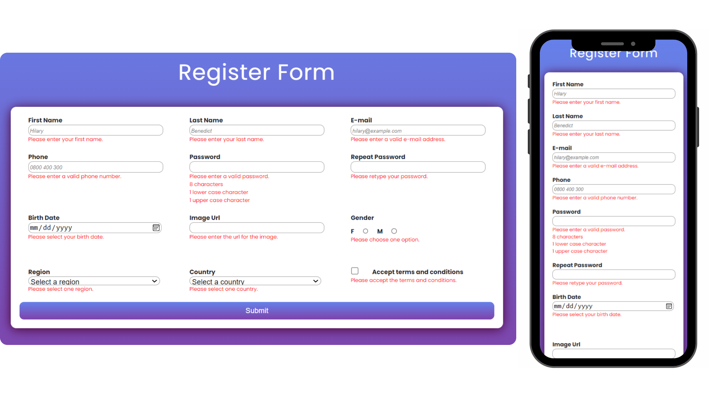

# Responsive Form validation on the client-side using HTML, CSS, Javascript, Regex, Ajax and Fetch API.

## Getting started

$ git clone: https://github.com/BiancaMarin/form-validation.git

Install the packages and the libraries to run the project:

$ npm install (install node modules)

$ npm i json-server (install json-server)

$ npm run json:server

### Regex patterns:

- [x] Phone: the phone number must contain 10 digits and the these must be between 0 and 9;
- [x] Password: the password must be at 8 characters and must contain 1 uppercase and 1 lowercase;
- [x] Email: the email addres must be a valid email address.

### Required

- [x] Make sure that the inputs are not empty;
- [x] Make sure that the radio and check buttons are checked;
- [x] Make sure that the options from dropdown are selected;
- [x] The age of the user must be over 18.

Errors are displayed with the red color in order to help the user to complete correctly the register form.

## Illustration

